git rebase -i HEAD~3

- The below code is called boilerplate or HTML skeleton.
```html
<!DOCTYPE html>  //tells browser that this is HTML5(older versions don't support all many things) - just means the page uses modren html
<html lang="en"> // content of the page is in english(helps screen readers, search engine SEO(search engine optimization))
<head>
  <meta charset="UTF-8"> // uses UTF-8 encoding for text( supports all langs, symbols and emojis)
  <meta name="viewport" content="width=device-width, initial-scale=1.0"> //name='viewpoint' means it fit page properly on mobile screen.(Phones have small screens
Without this, sites look zoomed out and tiny)
  <title>Document</title>
</head> // head means about page, but will not be in page or visisble in page
<body>
// appears on the screen, what ever is inside
</body>
</html>

```

-------------------------------------------------------------------------------

1. what is CSS?

# CSS_Cascading Style Sheets
- 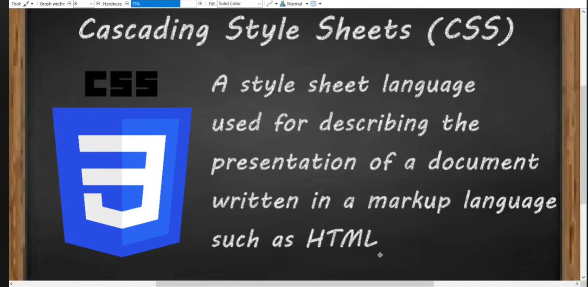
- For building a house we need strucutre, style and functionality.
- Similarly we need these 3 for building a website.
- 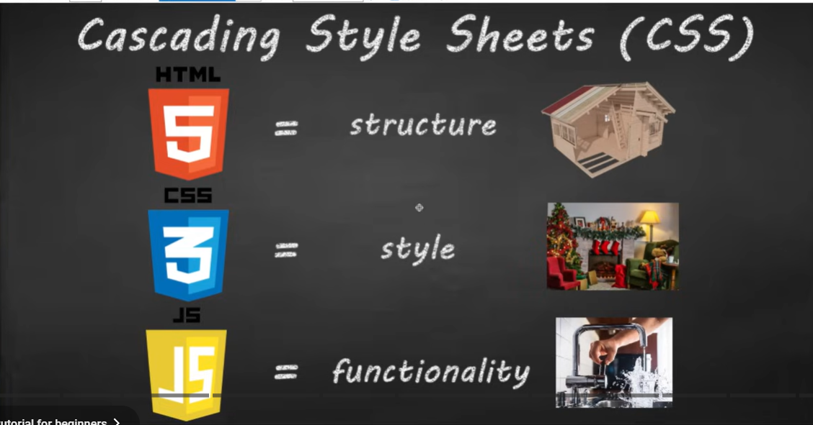
## Types of CSS:
- 
There re 3 types of CSS:
- Inline
- Internal
- External

- Inline CSS- due to seperation of concern

  - Inline CSS, or inline style, is a technique for applying a unique style to a single HTML element within the body of a webpage using the style attribute:
  <p style=``font-family:courier; text-align:left;''>This actual text goes here.</p>
  <h1 style=``color: red; font-size: 40px;''>Hello World</h1>

- Internal Or Embedded CSS-coloring a heading with head tags
  - /\* <!DOCTYPE html>
  <html>

<head> 
	<title>Internal CSS</title> 
	<style> 
		/* Internal CSS */ 
    	p {
    		color: blue;
    		font-size: 25px;
    		line-height: 1.5;
    		text-align: center;
    	}
    </style>

</head>

<body>

    <p>A Computer Science Portal..!</p>

</body>

</html> */
  - saves time to request css file and get it

- External CSS --prefered one, we can link that file to other html files
- For external CSS we need to link the style sheet to the html file with
```html
<link rel='stylesheet' href='style.css'> // used for linking html and css files, inside head tag
  <script src="script.js"></script> // for js file and this will be inside body
```
- Adv with external css is we can link on css with many html files.
- To style each 'p' element with diff styles we can mention any id/class/any attribute
- Precedance of attributes:
Element selector     → h1, div, p
Class selector       → .container
ID selector          → #main
Inline style         → style=""
!important           → highest

```css
.heading {
  color: black !important;
}
```
----------------------
- # Font- Family:
- We atleast mention 2 font-families. coz if one is not available for browser atleast it can use the other
- font-decoration- with underscore/dotted etc.
-------------------
- ### Box Model:
- Every element in html is treated as rectanglular box by the browser
- that box is made of 4 layers
+------------------------+
|        margin          |
|  +------------------+ |
|  |     border       | |
|  |  +------------+ | |
|  |  |  padding   | | |
|  |  | +--------+ | | |
|  |  | |content | | | |
|  |  | +--------+ | | |
|  |  +------------+ | |
|  +------------------+ |
+------------------------+
```css
.box {
  width: 200px; // height and width are  for content
  padding: 20px;
  border: 5px solid black;
  margin: 10px;
}
```
----------------------
- ### Background:
- linear gradient:
- background:linear-gradient(yellow,pink); // now this will apply for each element spepartely
- 
- background-repeat:no-repeat; // will not repeat but appies only till the elemtns like below
- 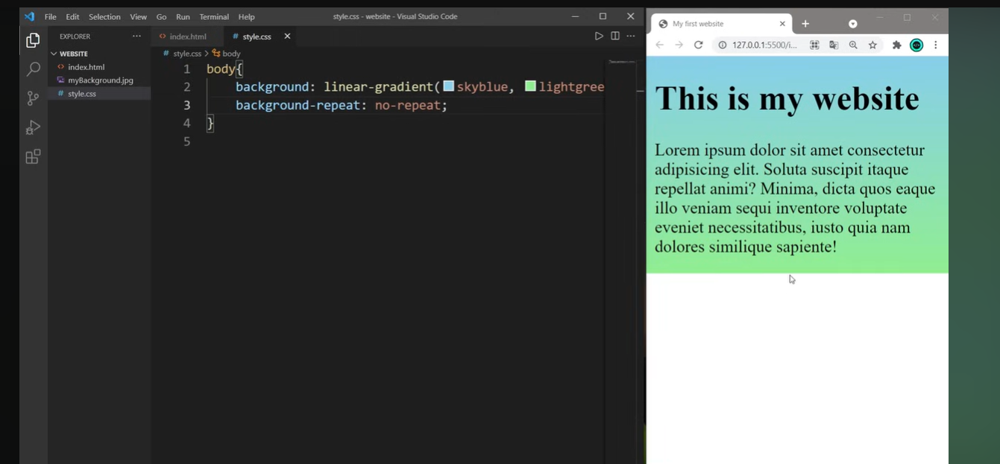
- background-attachment:fixed; // this will aplly to the entire page
- 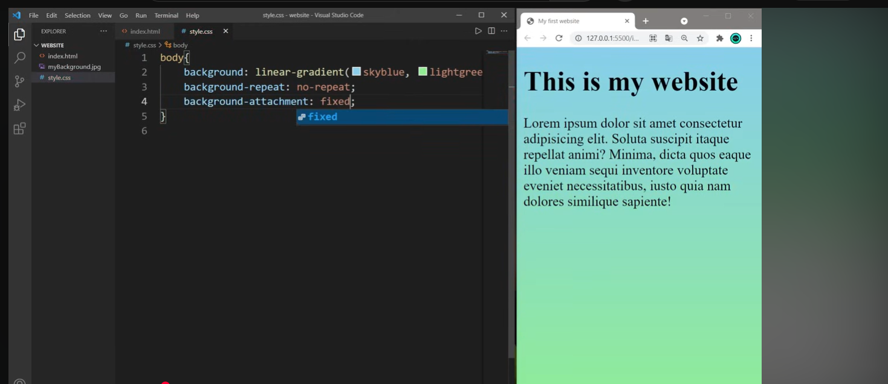
- To set an image as background : background-image: url("path/url");
- background-size:cover;// will fits the img in the background and will adjust evern if we resize the window
----------------
- Margins: space around an element
- margin: auto; // means will be in middle
------------
- ### Float:
-  positions an element to the left or right of a continer.
- ex: Popular for wrapping elemts arond images..
- 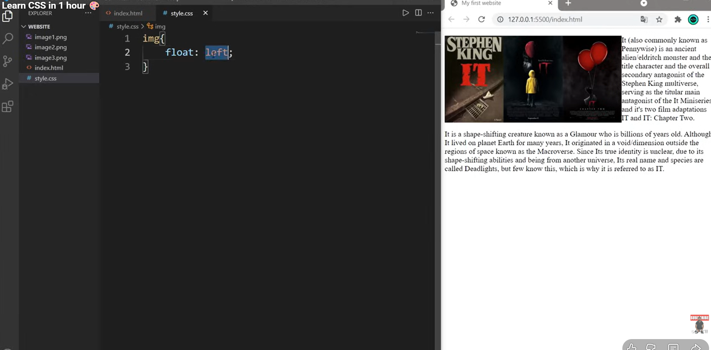
- 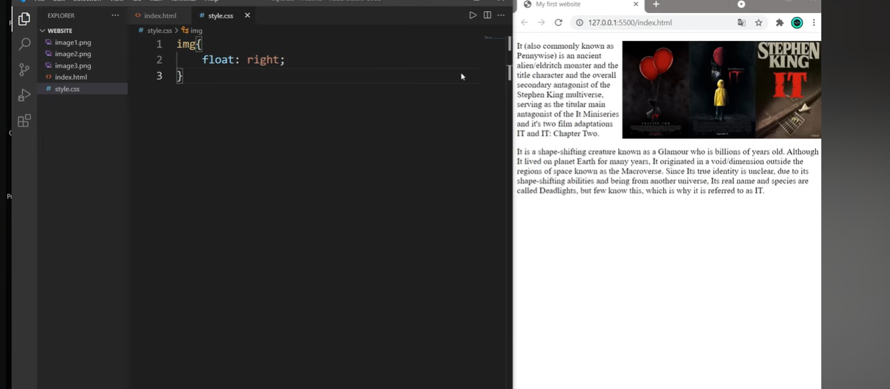
- If we need to stop the float can use clear
- 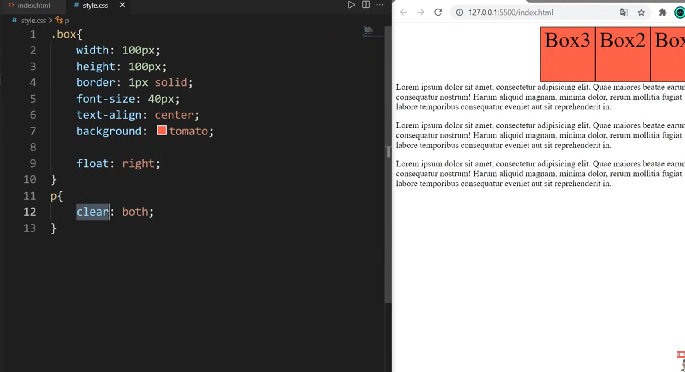

---------
- Block Level vs Inline Elements:
- block leave will starts in new line, defaultly takes full width.
1️⃣ Block-level elements
Start on a new line
Take full width by default
Can have width, height, margin, padding
Examples: <div>, <p>, <h1>–<h6>, <section>, <form>

2️⃣ Inline elements
Stay on the same line as surrounding text
Only take as much width as needed
Cannot set width or height (padding/margin works only horizontally)
Examples: <span>, <a>, <strong>, <em>

3️⃣ Inline-block elements
Hybrid of block and inline
Stays on same line like inline
But you can set width and height like block
Example:
<span style="display: inline-block; width: 100px; height: 50px; background: red;"></span>

| Type         | Line behavior | Can set width/height | Example        |
| ------------ | ------------- | -------------------- | -------------- |
| Block        | New line      | Yes                  | `<div>`        |
| Inline       | Same line     | No                   | `<span>`       |
| Inline-block | Same line     | Yes                  | `<span>` + CSS |

- Span- If we don't mention any style it will be inline and mentiosn any style(height and width) for that tag then becomes inline block
-----------------------------------------------------------
- #### POsition:
- static(default), relative, sticky, absolute and fixed.
- relative: We can set top,left,right etc with relative.(Think: “I shift myself a little, but the space I originally occupied stays empty.”)
- Absolute: 
- 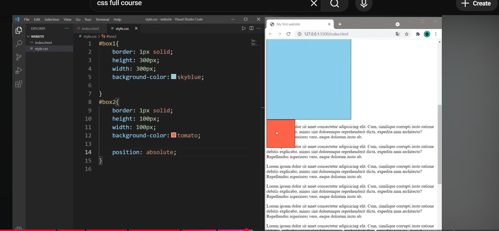
- Positioned relative to the nearest ancestor with position: relative or absolute.
- If no ancestor, positioned relative to document body.
- Removed from normal flow → other elements ignore it.
- ✅ Commonly used for tooltips, popups, icons.
- 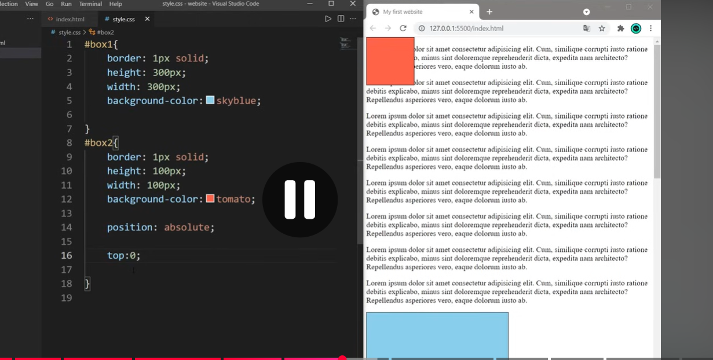
- If we set absoute as child for any relative elemt, when we change the parent the child will also follow as shownx:
- 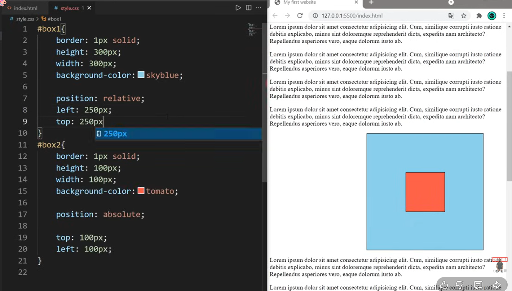
- Fixed: If we set it at one point even we scroll it will be there fixed.
- 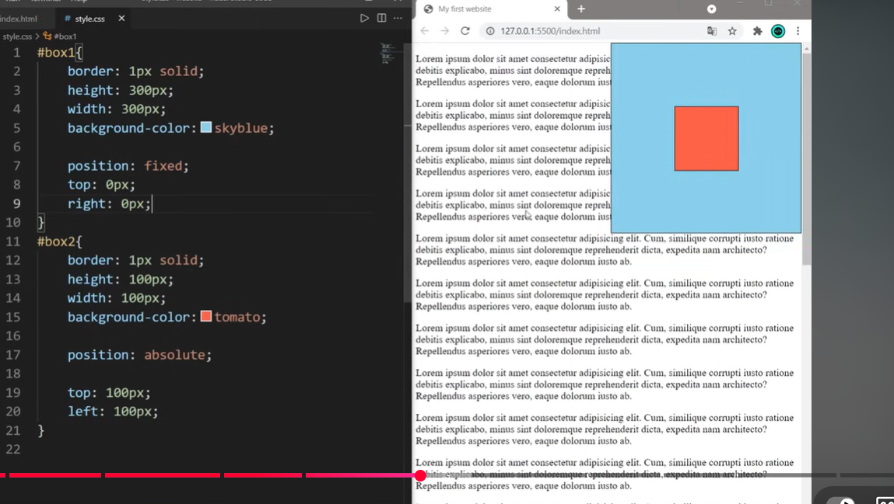
- Sticky: It will stick at a top of my view point when we scroll it will be going to stck it the top if we scroll down more. only if top=0
- 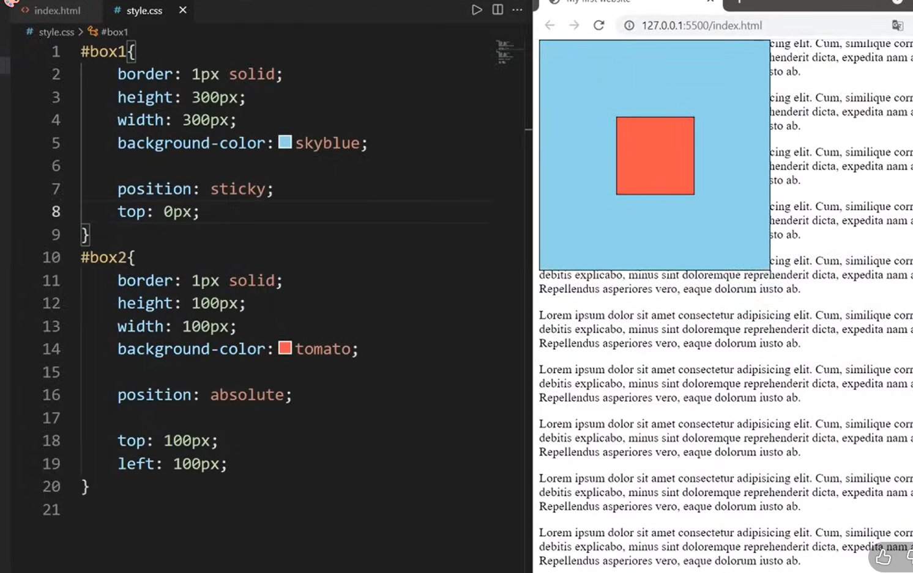
- If bottom=0; means will stick to the bottom when we scroll up 
- top=0; bottom=0; works like both

- ###### Quick visual analogy
Static → normal line of people
Relative → you step a little forward/back, but people behind don’t fill your original spot
Absolute → teleport somewhere in the room; others ignore you
Fixed → stay glued to the top of the room, even if the room scrolls
Sticky → walk with the group, but freeze at a line when you reach it

--------------------------------------------------
- #### Pseudo classes:
- 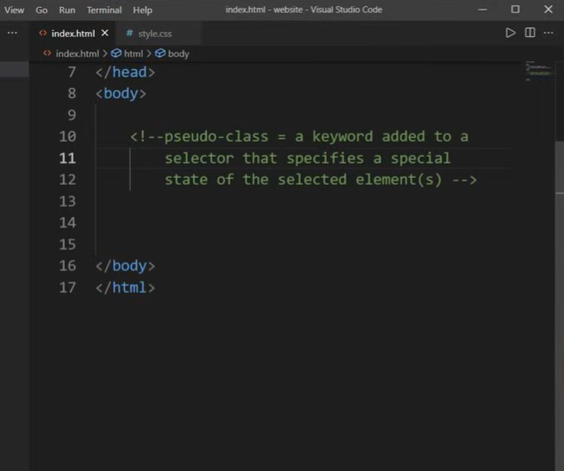
- In css file when we select any element like a:(pseudoclass)link/before etc.
- ex:
```html
<a href='www.google.com'>google</a>
```
```css
a:link
{
  color:lawngreen;
}
a:visited
{
  color:grey;
}
a:hover
{
  color:tomato;
}
```
- 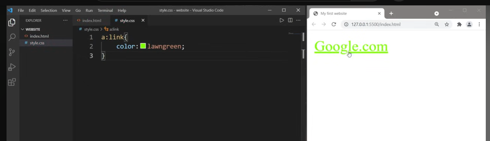
- 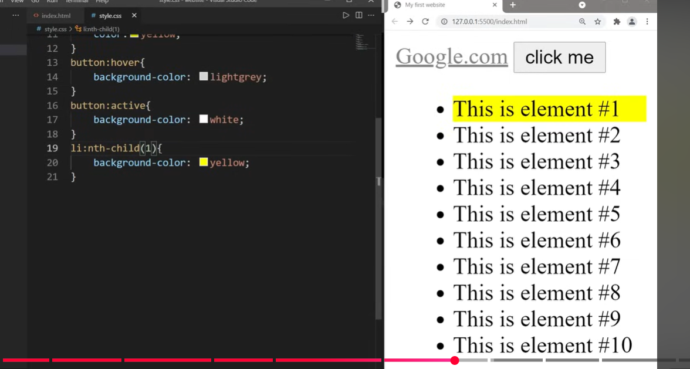
- 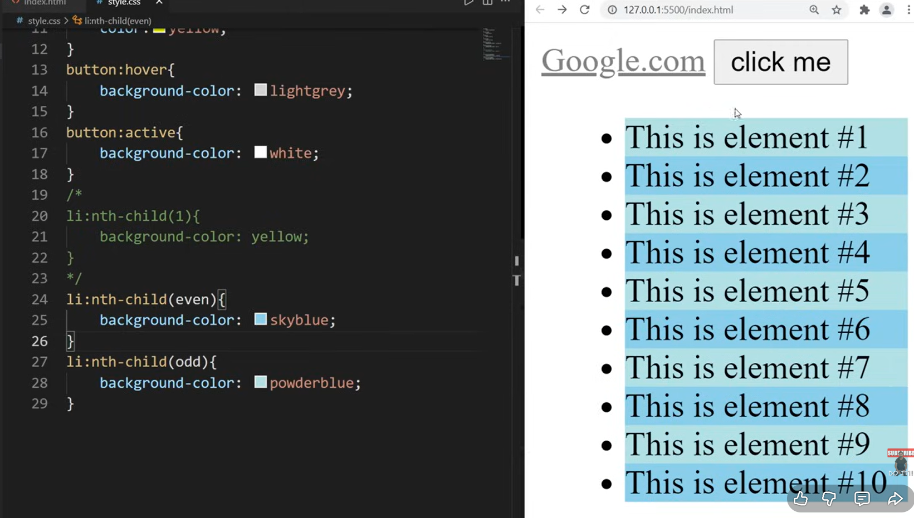
- 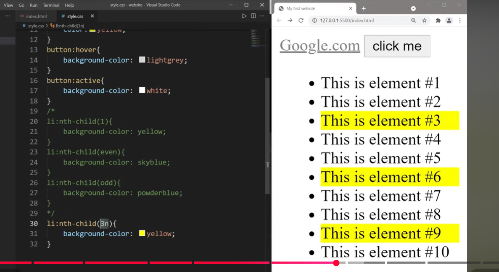
- For nthChild pseudo class, we can pass a formula also
-------------------------------------------------------------
- ### Shadows:
- 2 types of shadows-Text and box shadow
- Text Shadow: 
- 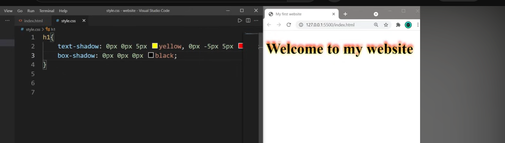
```css
h1
{
  text-shadow: 0px 0px 5px yellow, 0px -5px 0px red;
}
```
- we can add multiple by seperating with ",".
- Box shadow: The entire element is having the shadow
- 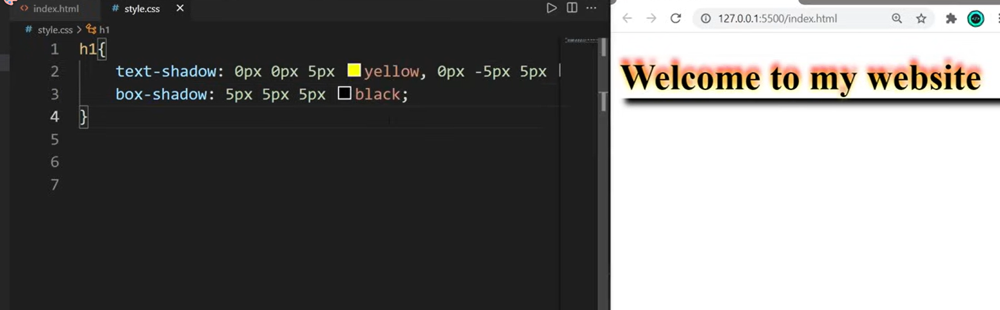
-------------------------------------------------------------
- #### Transform:
- 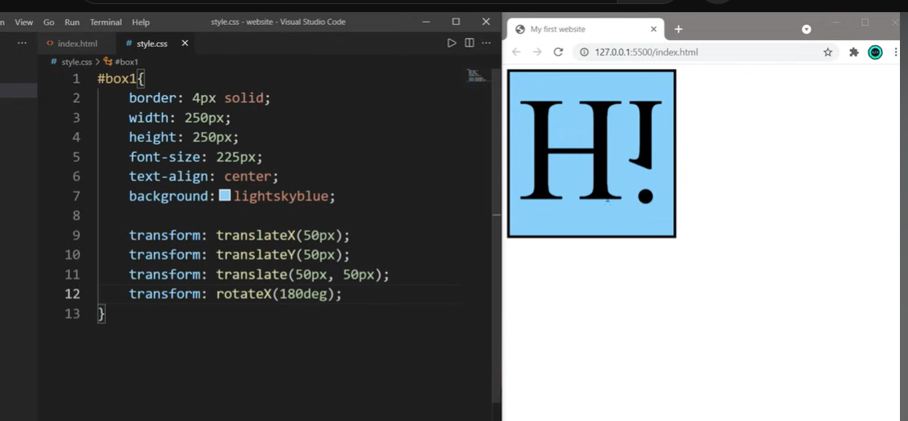
- 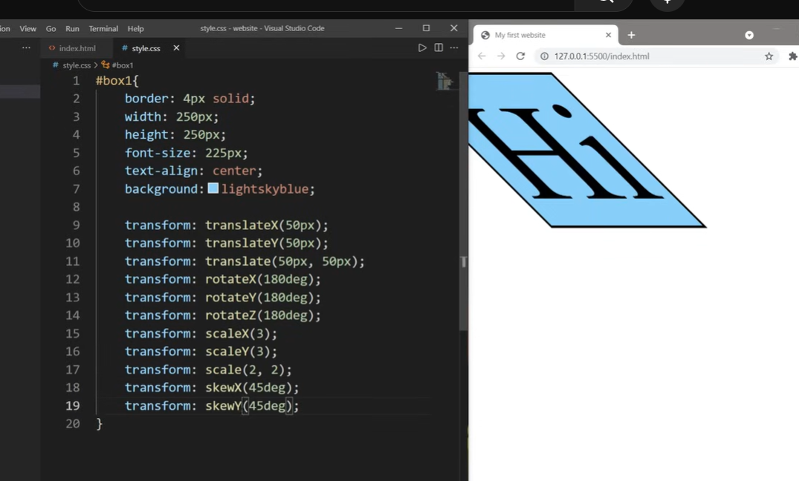


----------------------------------------------------------------------
----------------------------------------------------------------------
## CSS Terms


## Text Styling

1.  font-size
2.  font-weight --how thick you want the text to be
3.  font style --italic
4.  color --text color

### Color formats

1. name
2. rgb
3. HEX value-oldest -supports all
4. hsl(Hue, saturation, and lightness)--more human friendly
   - hue--color alone
   - saturation-- color poopoing up if saturation is high
   - lightness--adding white to the color
5. lch-not supported by rgb,better colors-have better color gamet-implemented 1st by safari
   srgb,dcpi,Adobe SRGB--other color gamut

## TextStyling -2

1. text transform--upper case,lower case
2. text-align
3. text decoration
4. letter-spacing-for brands like GUCCI
5. line-height->inversly proportional to font size

   - line height avoids rereading of lines


# Text Family

serif----for trust,tradational,serious,oldest,scured..(ex--paper,gold etc)
sans serif--- for other websites like tranding,chill etc

## Box Model:

> margin --
> border  
> padding --
> content

max-width--to avoid scrool bar when we zoom out it then text should come to next line
Note: Imporant

> 1vh=1% of screen height  
> 1vw=1% of screen width  
> width=1% of container width
> 1px=absolute
> 1% -relative
> Note: To change the color gradiently--generer a css color gradient--it will combine nd gives the color
> inline---occupy only content width (anchor tag ,span)
> bloch--will occupy entire width of the computer (heading ,paragraph elements)
> clip-path-->masking
