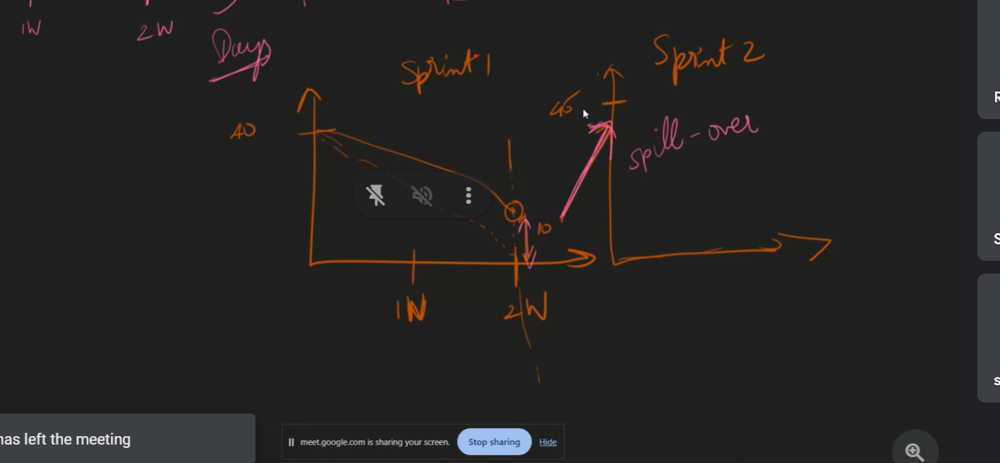
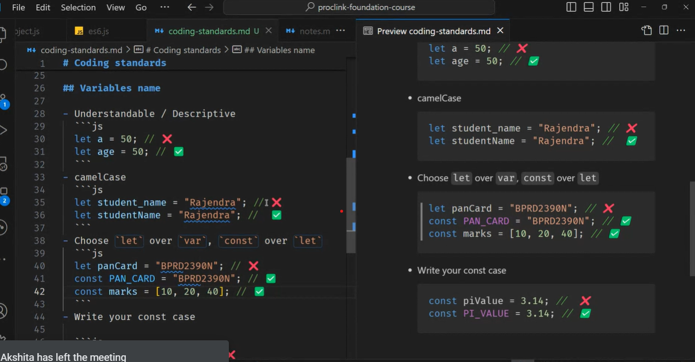

# DataBase: --special software to store datas

> db the special software will do the things automatically
> 
> it will store the frequently asking a data it will keep /\*that data in RAM, and the hole process i is doing automatically the special software.
>  > 
> SSD is faster than Hard Disk
> We can't keep database in our system not because of storage but becausse of load (no.of people requestung)

## Features:

1.  database-frequently asked will have it in the ram
2.  quering becomes easier
3.  CRUD-easy
4.  Backups are inbulit
5.  Undo-easily(time limit)
6.  Performance

## what is cloud? renting pc

> ## not provide cloud:

- google drive,drop box

### ex: aws,azure,IBM cloud

> AWS,Azure--order

> buying--8

- inital cost
- space (rent room)
- (Ac)
- current bill
- maintainance--swaping the harddisk
- spares--money
- Generator

## Disaster Management:

- choose a place where it doesn't prone to disaster
- backup in diff places(states,countries, continent)

### cloud has linux os

> most used OS is Linux

## Linux adv:

- open source--every one on same boast,security
- free
- Secure
- Small Footprint--linux<1gb,windows-40gb--if more gb means more money
- Automation--from command panel(terminal) can do many things

> destros(flavours)--alpine for cloud--it has smallfootprint--256Mb

# Scaling: 2 types

> ex:results  
> increaing no.of customers  
> adding more powerful CPU, increasing RAM---vertical scaling
> incresing ram, hardware--vertical scaling  
>  > 
> in automatic scaling---pay as you go even for 1 hr
> adding more PCs--horizontal scaling

> 

> --redirect it to the dummy site
> To avoide the
> region IP
> captcha

# SQL

> data is stored in tables(relational database)  
> ex MySQL,Postgre SQL
> 

# NOSQL:

> stored in documnets,JSON
> mongodb,dynamo db,etc
> redis---very fast--they put this on top of a data base
> cassandra--netflix uses this
> 
> sql exercise--[https://sqlbolt.com/lesson/select_queries_with_constraints_pt_2]
> = --case sensitive
> Like--case insensitive

## where, order, limit offfset--clauses

# Normalization


>  >  > --mapping table or injenction table
> problems are:

1. storage
2. update anomaly--half half upadted, if we update in one row suddenly sql crashes then if some rows are doesn't got updated--halfhalf
   > 
   > Primary Key  
   > -- unique  
   > -- not null  
   > -- only one primary key colomn in the table  
   > Foreign Key  
   > --join table  
   > -- primary another table  
   > -- can be null

> so to avoide this problem we create more tables and we only have to join the tables.

# why Normalization

1.  to increase safety-if we go on doing more normalization the safety will get increased

# 1-NF:


1. order
2. 
3. 
   > if one comomn can't be primary key-- 2 coloms combined will become primary key that combine to key is called composite key

---

# 2NF:

>  > 
> upadate anamoly
> deletion anomly
> insertion anamoly

# 3NF:

> should not be there dependency on non key attributes
> non key attributes should not be depend on each other
> 

# BCNF

> every attribute should depend only on primary key

# Joins:

>  >  > 

>  >  >  > 

# Aggregation:

> means summarization in one line

Common aggregate functions
Here are some common aggregate functions that we are going to use in our examples:

> 
> if "every position"-- use group by aggregation fn--drip down one level lower

> NOTE: Having is used after the group by we can't use where after the group by

SELECT group_by_column, AGG_FUNC(column_expression) AS aggregate_result_alias, …
FROM mytable
WHERE condition
GROUP BY column
HAVING group_condition;

> after group by ---having
> before group by---where

> 

# Altering:

1. Altering table to add new column(s)
   ALTER TABLE mytable
   ADD column DataType OptionalTableConstraint
   DEFAULT default_value;

2. Altering table to remove column(s)
   ALTER TABLE mytable
   DROP column_to_be_deleted;

3. Altering table name
   ALTER TABLE mytable
   RENAME TO new_table_name;

# DML

> 

- select
- delete
- update
- insert

# DDL

CREATE TABLE salesman (
salesman_id INT PRIMARY KEY,
name VARCHAR(255),
city VARCHAR(255),
commission DECIMAL(4, 2)
);

Select \* from salesman

INSERT INTO salesman (salesman_id, name, city, commission) VALUES
(5001, 'James Hoog', 'New York', 0.15), -- Print
(5002, 'Nail Knite', 'Paris', 0.13),
(5005, 'Pit Alex', 'London', 0.11), -- Print
(5006, 'Mc Lyon', 'Paris', 0.14), -- Print
(5003, 'Lauson Hen', NULL, 0.12),
(5007, 'Paul Adam', 'Rome', 0.13); -- Print

--Task 1
--Find the average commision of a saleman from Paris
select avg(commission) as average from salesman
where city='Paris';

--Task 2
--Find out
--if there are cities with only one salesman and list them | No nulls
--Clue: Having
select city ,count(city) from salesman
where city is not null
group by city
having count(name)=1

CREATE TABLE orders (
ord_no INT PRIMARY KEY,
purch_amt DECIMAL(10, 2),
ord_date DATE,
customer_id INT,
salesman_id INT
);

INSERT INTO orders (ord_no, purch_amt, ord_date, customer_id, salesman_id) VALUES
(70001, 150.5, '2012-10-05', 3005, 5002),
(70009, 270.65, '2012-09-10', 3001, 5005),
(70002, 65.26, '2012-10-05', 3002, 5001),
(70004, 110.5, '2012-08-17', 3009, 5003),
(70007, 948.5, '2012-09-10', 3005, 5002),
(70005, 2400.6, '2012-07-27', 3007, 5001),
(70008, 5760, '2012-09-10', 3002, 5001),
(70010, 1983.43, '2012-10-10', 3004, 5006),
(70003, 2480.4, '2012-10-10', 3009, 5003),
(70012, 250.45, '2012-06-27', 3008, 5002),
(70011, 75.29, '2012-08-17', 3003, 5007),
(70013, 3045.6, '2012-04-25', 3002, 5001);

Select \* from orders;

-- Task 3 - Sub-Query
-- Write a query to display all the orders from the orders table issued by the salesman 'Paul Adam'.
select \* from orders
inner join salesman
on orders.salesman_id=salesman.salesman_id
where name='Paul Adam'

-- step-1 : hard coding
select _ from orders where salesman_id=5007
-- step-2: wrtingin query to get 5007
select salesman_id from salesman
where name='paul Adam'
-- step-3: replacing as nested query
select _ from orders
where salesman_id= (select salesman_id
from salesman
where name='paul Adam')
-- Task 4
-- Write a query to display all the orders which values are greater than the average order value for 10th October 2012
select \* from orders

select \* from orders
where purch_amt>(select avg(purch_amt) from orders
where ord_date='2012-10-10')

select avg(purch_amt) from orders
where ord_date='2012-10-10'

--group by purch_amt

-- Task 5 (Challenging)
-- Write a query to find all orders with order amounts which are above-average amounts for their customers.
select avg(purch_amt)
from orders

---

select \* from orders
where purch_amt>(select avg(purch_amt)
from orders)

---

select salesman_id,avg(purch_amt) from orders
group by salesman_id

---

select salesman_id,avg(purch_amt) from orders
group by salesman_id
having avg(purch_amt)>(select avg(purch_amt)
from orders)

---

-- Task 6
-- Write a query to find all orders attributed to a salesman in 'Paris'
-- Clue: In
select _ from orders
select _ from salesman
select \* from orders
where salesman_id=5006

---

select \* from orders
where salesman_id in (select salesman_id from salesman where city='paris')

---

select \* from orders
join salesman
on orders.salesman_id=salesman.salesman_id
where city='paris'

---

CREATE TABLE customer (
customer_id INT PRIMARY KEY,
cust_name VARCHAR(255),
city VARCHAR(255),
grade INT NULL,
salesman_id INT
);
INSERT INTO customer (customer_id, cust_name, city, grade, salesman_id) VALUES
(3002, 'Nick Rimando', 'New York', 100, 5001),
(3005, 'Graham Zusi', 'California', 200, 5002),
(3001, 'Brad Guzan', 'London', NULL, 5005),
(3004, 'Fabian Johns', 'Paris', 300, 5006),
(3007, 'Brad Davis', 'New York', 200, 5001),
(3009, 'Geoff Camero', 'Berlin', 100, 5003),
(3008, 'Julian Green', 'London', 300, 5002),
(3003, 'Jozy Altidor', 'Moscow', 200, 5007);
-- Task 7
-- Write a query to find the name and id of all salesmen who had more than one customer

---

select \* from salesman
select count(name) from salesman
group by name

---

select _ from customer
select _ from salesman
select customer.salesman_id,count(customer.salesman_id) from salesman
join customer
on salesman.salesman_id=customer.salesman_id
group by customer.salesman_id
having count(customer.salesman_id)>1
--where (select count(name) from salesman group by name)>1

---

select salesman_id,count(salesman_id) from customer
group by salesman_id
having count(salesman_id)>1

> foreign key constaints--
>  >  > 
> Integer -int ,smallint, bigint
>  > 
> n varchar--supports multiplr characters
> instread of text---nvarchar(max)

> 

> boolean--bit(0/1)
> types of functions-4

- string
- aggregation
- format
- Math fns

# Functions:

-- String Functions
--1. Len  
select len('bhanusri') as length--8
-- 2. Left
select Left('bhanu',2)-- bh
-- 3. right
select Right('bhanu',2)-- nu
-- 4. substring
select substring('bhanusri',3,3)--anu
select substring('bhanusri',3,1)
-- 5. upper
select upper('bhanu')--BHANU
-- 6. lower
select lower('bhAnu')--bhanu
-- 7. trim
select trim(' bhanu sri ')-- bhanu sri
-- 8. Ltrim
select Ltrim(' bhanu sri ')
select Ltrim('bhanusri','bhanu')-- sri
--9. Rtrim
select Rtrim(' bhanu sri ')-- bhanu sri
-- 10. charIndex
select charIndex('n','bhanu')--4
select charIndex('N','bhanu')--4
select charIndex('y','bhanu')--0
select charIndex('cool','this is cool')--9
-- 11. Replace--string,which one you eant to replace, replace it with what
select Replace('abcbbb','b','c')
select Replace('bhanusri','sri','sree')--bhanusree
-- 12. concat
select concat('bhanu','sri')-- bhanusri
select concat('bhanu',6)-- bhanu6
-- 13. Replicate--repeat
select Replicate ('bhanu ',5)--bhanu bhanu bhanu bhanu bhanu
-- 14. Reverse
select Reverse('bhanu')--unahb
select Reverse(56387426)--62478365

---

-- Mathametical fns
--1. Abs
select Abs(-9)--9
select Abs(-3.2384)--3.2384
--2. Power
select power(2,3)--8
-- 3. Round
select Round(2.23486476,2)--2.23000000
-- 4. ceiling
select ceiling(34.23)--35
-- 5. Floor
select Floor(34.23)--34

---

-- Date Functions
-- 1. GetDate
select GetDate() as today--2024-06-13 12:49:35.547
-- 2. DateAdd
select DateAdd(day,11,GetDate()) as today--2024-06-23 12:53:55.707
-- 3. DateDiff
select DateDiff(day,'2024-01-01',GetDate()) as today--2024-06-13 12:49:35.547
select DateDiff(hour,'2024-01-01',GetDate())-- 3949
-- 4. Format
select Format(GetDate(), 'dd/mm/yy') -- 13/03/24
select Format(GetDate(), 'dd/MM/yy') -- 13/06/24
select Format(GetDate(), 'dddd/MMMM/yyyy') -- Thursday/June/2024
select Format(GetDate(), 'dddd/mmmm/yyyy') -- Thursday/05/2024
-- 5. DatePart-- which part of the date you want
select DatePart(month,GetDate()) as today --6
select DatePart(day,GetDate()) as today--13
select DatePart(year,GetDate()) as today--2024

---

---

# TAsk_1

CREATE TABLE salesman (
salesman_id INT PRIMARY KEY,
name VARCHAR(255),
city VARCHAR(255),
commission DECIMAL(4, 2)
);

Select \* from salesman

INSERT INTO salesman (salesman_id, name, city, commission) VALUES
(5001, 'James Hoog', 'New York', 0.15), -- Print
(5002, 'Nail Knite', 'Paris', 0.13),
(5005, 'Pit Alex', 'London', 0.11), -- Print
(5006, 'Mc Lyon', 'Paris', 0.14), -- Print
(5003, 'Lauson Hen', NULL, 0.12),
(5007, 'Paul Adam', 'Rome', 0.13); -- Print

--Task 1
--Find the average commision of a saleman from Paris
select avg(commission) as average from salesman
where city='Paris';

--Task 2
--Find out
--if there are cities with only one salesman and list them | No nulls
--Clue: Having
select city ,count(city) from salesman
where city is not null
group by city
having count(name)=1

CREATE TABLE orders (
ord_no INT PRIMARY KEY,
purch_amt DECIMAL(10, 2),
ord_date DATE,
customer_id INT,
salesman_id INT
);

INSERT INTO orders (ord_no, purch_amt, ord_date, customer_id, salesman_id) VALUES
(70001, 150.5, '2012-10-05', 3005, 5002),
(70009, 270.65, '2012-09-10', 3001, 5005),
(70002, 65.26, '2012-10-05', 3002, 5001),
(70004, 110.5, '2012-08-17', 3009, 5003),
(70007, 948.5, '2012-09-10', 3005, 5002),
(70005, 2400.6, '2012-07-27', 3007, 5001),
(70008, 5760, '2012-09-10', 3002, 5001),
(70010, 1983.43, '2012-10-10', 3004, 5006),
(70003, 2480.4, '2012-10-10', 3009, 5003),
(70012, 250.45, '2012-06-27', 3008, 5002),
(70011, 75.29, '2012-08-17', 3003, 5007),
(70013, 3045.6, '2012-04-25', 3002, 5001);

Select \* from orders;

-- Task 3 - Sub-Query
-- Write a query to display all the orders from the orders table issued by the salesman 'Paul Adam'.
select \* from orders
inner join salesman
on orders.salesman_id=salesman.salesman_id
where name='Paul Adam'

-- step-1 : hard coding
select _ from orders where salesman_id=5007
-- step-2: wrtingin query to get 5007
select salesman_id from salesman
where name='paul Adam'
-- step-3: replacing as nested query
select _ from orders
where salesman_id= (select salesman_id
from salesman
where name='paul Adam')
-- Task 4
-- Write a query to display all the orders which values are greater than the average order value for 10th October 2012
select \* from orders

select \* from orders
where purch_amt>(select avg(purch_amt) from orders
where ord_date='2012-10-10')

select avg(purch_amt) from orders
where ord_date='2012-10-10'

--group by purch_amt

-- Task 5 (Challenging)
-- Write a query to find all orders with order amounts which are above-average amounts for their customers.
select avg(purch_amt)
from orders

---

select \* from orders
where purch_amt>(select avg(purch_amt)
from orders)

---

select salesman_id,avg(purch_amt) from orders
group by salesman_id

---

select salesman_id,avg(purch_amt) from orders
group by salesman_id
having avg(purch_amt)>(select avg(purch_amt)
from orders)

---

-- Task 6
-- Write a query to find all orders attributed to a salesman in 'Paris'
-- Clue: In
select _ from orders
select _ from salesman
select \* from orders
where salesman_id=5006

---

select \* from orders
where salesman_id in (select salesman_id from salesman where city='paris')

---

select \* from orders
join salesman
on orders.salesman_id=salesman.salesman_id
where city='paris'

---

CREATE TABLE customer (
customer_id INT PRIMARY KEY,
cust_name VARCHAR(255),
city VARCHAR(255),
grade INT NULL,
salesman_id INT
);
INSERT INTO customer (customer_id, cust_name, city, grade, salesman_id) VALUES
(3002, 'Nick Rimando', 'New York', 100, 5001),
(3005, 'Graham Zusi', 'California', 200, 5002),
(3001, 'Brad Guzan', 'London', NULL, 5005),
(3004, 'Fabian Johns', 'Paris', 300, 5006),
(3007, 'Brad Davis', 'New York', 200, 5001),
(3009, 'Geoff Camero', 'Berlin', 100, 5003),
(3008, 'Julian Green', 'London', 300, 5002),
(3003, 'Jozy Altidor', 'Moscow', 200, 5007);
-- Task 7
-- Write a query to find the name and id of all salesmen who had more than one customer

---

select \* from salesman
select count(name) from salesman
group by name

---

select _ from customer
select _ from salesman
select customer.salesman_id,count(customer.salesman_id) from salesman
join customer
on salesman.salesman_id=customer.salesman_id
group by customer.salesman_id
having count(customer.salesman_id)>1
--where (select count(name) from salesman group by name)>1

---

select salesman_id,count(salesman_id) from customer
group by salesman_id
having count(salesman_id)>1

## -- use shop ---switch db

---

# Task_2

create table Employees(
EmployeeID int ,
FirstName nvarchar(30),
LastName nvarchar(30),
DepartmentID int
)
select \* from Employees
insert into Employees(EmployeeID,FirstName,LastName,DepartmentID) values
(1, 'John','Doe',101),
(2,'Jane','Smith',102),
(3,'Alice','Johnson',103)

---

create table Departments (
DepartmentID int,
DepartmentName nvarchar(30)
)
select \* from Departments
drop table Departments
insert into Departments(DepartmentID,DepartmentName) values
(101,'Sales'),
(102,'Engineering'),
(103,'Marketing')
select EmployeeID,
upper(concat(FirstName, ' ' ,LastName)) as FullName,
DepartmentName from Employees
join Departments
on Employees.DepartmentID=Departments.DepartmentID

---

--Exercise 1: Employee Full Name
--Scenario: You need to create a list of employees with their full names in uppercase.
select EmployeeID, upper(concat(FirstName,' ',LastName)) as FullName
from Employees

---

---

create table Products(
ProductID int ,
ProductName nvarchar(30),
ProductDescription nvarchar(30)
)
select _ from Products
insert into Products(ProductID,ProductName,ProductDescription) values
(101,'Widget A','A standard widget'),
(102,'Gadget B','A fancy new gadget'),
(103,'Thingamajig','A very useful tool')
-- drop table Products
--Exercise 4: Enhanced Product Search
select _,
replace((select ProductDescription from Products
where ProductDescription like '%useful%'),'useful','beneficial')
from Products where ProductDescription like '%useful%';

---

select ProductDescription from Products
where ProductDescription like '%useful%'
--Exercise 2: Product Description Length
--Scenario: You need to find the length of the product descriptions.
select ProductID, ProductName, Len(ProductDescription) as DescriptionLength
from Products

---

select ProductID, ProductName,
Len(ProductDescription) as DescriptionLength ,
Reverse(substring(ProductDescription,10,len(ProductDescription)+1)) as ReversedDescription
from Products

---

create table SalesOrders(
SalesOrderID int,
CustomerID int ,
OrderDate DateTime,
TotalAmount decimal(10,2)
)
select \* from SalesOrders
drop table SalesOrders
insert into SalesOrders(SalesOrderID,CustomerID,OrderDate,TotalAmount) values
(1001,201,'2023-01-15 14:33:00','150.00'),
(1002,202,'2023-03-22 10:45:00','200.00'),
(1003,203,'2024-05-17 09:20:00','350.00')
--drop table SalesOrders
--Exercise 3: Sales Date Formatting
--Scenario: You need to display sales order dates in the YYYY-MM-DD format.
select SalesOrderID, Format(OrderDate,'yyyy-MM-dd') as FormattedOrderDate
from SalesOrders
-- Exercise 3: Sales Analysis by Customer and Year

select Customers.customerID,CustomerName,
DatePart(year,OrderDate) as Year,
TotalAmount as TotalSales
from SalesOrders
join Customers
on SalesOrders.CustomerID=Customers.CustomerID
--group by CustomerName
order by CustomerID

---

create table Customers(
CustomerID int,
CustomerName nvarchar(30),
--Address nvarchar(30)
)
select \* from Customers
drop table Customers
insert into Customers(CustomerID,CustomerName) values
(201,'Acme Corp'),
(202,'Globex Inc'),
(203,'Initech')
--Exercise 4: Customer Address Cleanup
--Scenario: You need to remove leading and trailing spaces from the customer addresses.
select CustomerID,CustomerName,Trim(Address) as CleanedAddress
from Customers

---

--Exercise 5: Sales Summary by Year
--Scenario: You need to show the total sales amount for each year.

---

select DatePart(year,OrderDate) as Year,sum(TotalAmount) as TotalSales from SalesOrders
group by DatePart(year,OrderDate)

---

-- Exercise 5: Detailed Sales Report
select _ from SalesOrders
select _ from Customers

---

select SalesOrders.SalesOrderID, Customers.CustomerName, Format(SalesOrders.OrderDate,'yyyy-MM-dd'), SalesOrders.TotalAmount
from SalesOrders
join Customers
on SalesOrders.CustomerID=Customers.CustomerID

> # Decimal--
>
> Decimal(low performance)--exact--decimal(10,2)
> Float(high performance)--approx
> boolean--bit

# Sets:

> 

---

> # 18-06-24
>
> | TransactionID | Date | ProductName | Category | Price | StoreName | City | Country | |---------------|------------|-------------|-----------|-------|-----------|------------|---------| | 1 | 2024-04-01 | Laptop | Electronics | 1200 | TechWorld | San Francisco | USA |

           | 2 | 2024-04-01 | Smartphone | Electronics | 800 | TechWorld | San Francisco | USA | |  3   | 2024-04-02 | Jeans | Apparel | 40 | FashionFiesta | New York | USA |

> cardinality----one-to-one
>   
> 

# 20-06:

> types of Keys:
> 

- super key > 
- candidate Key--includes all the coloms wich are eligible to become a primary key
- alternative Key--
- primary Key
- foreign Key
  > Cross Join--gives all combinations
  >  > 

# Inner Join

> for condition we can also use <,> ,=
> Types

1. natural Join--don't need to tmention the condition.
   > both table should have same colomn name
   ```sql select * from emloyee
   natural join Department
   ```

# Constaints:

> not null
> unique
> auto increment--identity(1,1)
> check
> foreign key--cascading delete

---

SELECT \*
FROM products

1. NATURAL JOIN categories;

2. Equi join
   -- have to mention the condition
   -- condition is always =
   
3. Self JOin:
   > combining the table with it self
   > 
4. cross Join:
   > matrix multiplication

# XML and JSON:

---

> Functions:
> Custome functions

- result can be scalar(number,string) or table

## Declaring a variable

> ----Declaring a variable---getting values from the user
> Declare @id int--------variable declaration
> set @id=3 -------assignment
> ---------------------using it
> Declare @id1 int=1--------variable declaration and assignment
> select \* from Movies
> where Moviesid=@id1

# Functions:

-------Functions---
create Function CaluculateAge(@ReleaseDate int)
returns int
As
Begin
return DateDiff(Year,@ReleaseDate, GetDate());
End;

-------------------CAST-----------------------------

```sql
SELECT CAST('abcbhanuari' AS varchar(4)) COLLATE French_CS_AS;
SELECT CAST(10.6496 AS INT) AS trunc1,
       CAST(-10.6496 AS INT) AS trunc2,
       CAST(10.6496 AS NUMERIC) AS round1,
       CAST(-10.6496 AS NUMERIC) AS round2;
-------------------------------------------------------------------------------
SELECT CONVERT(int,25.56)
--select  CONVERT(INT, 50) LIKE '33%'
select CONVERT(DATETIME, '2006-04-25T15:50:59.997', 126) AS UsingConvertFrom_ISO8601;
--Convert the binary value 0x4E616d65 to a character value.
SELECT CONVERT(CHAR(8), 0x4E616d65, 0) AS [Style 0, binary to character];
select convert(int,sales_amount) from sales_data
select * from sales_data
```

# fetch--offset, limit

# top---offset

```sql
create Function CaluculateAge3(@ReleaseDate int)
returns int
As
Begin
         return year(GetDate())-@ReleaseDate;
End;
------------------top 3------------------------------------------------------
select   *, dbo.CaluculateAge3([year]) as age
from Movies
order by age desc
offset 3 rows--skips 3 rows
fetch next 3 rows only ;--limit
```

# Views--virtual table

> uses--convinence--reuse,for easy readibility, - hiding the complexity,abstraction, for others who don't know about sql
> not created a new table, just copying the table
> -- just like copy by refernce

```sql
create view vWLastDecade_Movies--vW to know that its a view
as
select * from Movies
where year between 2010 and 2020
select * from  vWLastDecade_Movies-- to access the view
```

1. Readibily---Complex statemet -create view- Easily readability
2. Abstraction
3. security--to hide some coloms,access to only

---

---

# Functions:

-- we can update and delete

# Table Valued Function

> Single Values
> Inline Table valued function
> Multi Table Value Function--insert update, delete ect inside function.,
> in MTVF all DML commmands we can do for the same table

```sql
create function dbo.functionName()
returns @LastestMovies Table(title varchar(20),year int, Genre varchar(10))
as
begin
insert into @LastestMovies
select * from Movies
where year>2015
```

# Case:

# Stored Procedure:

. LIMITATION of function---can't modify the table which are not mentioned inside the function.

```sql
-- Stored Procuedures:can modify any table not only the
-- inbuilt stored procedure is declared as sp_name
exec sp_helptext spGetMoviesByGenre--to knoe what is inside, if we forgot sometimes
create Procedure spGetMoviesByGenre
  @Genre nvarchar(20)
as
Begin
   select * from Movies
   where Genre=@Genre
end
Exec spGetMoviesByGenre 'Action'
Execute spGetMoviesByGenre 'Action'

--if : print--------------
Decalre @OrderAmount Decimal(10,2)=1500.00
If @OrderAmount > 1000
Begin
      print 'Applying 10% discount'
end
else
Begin
  print ' no disscount'
end
-----------While--------------------------
Declare @Counter Int = 10

While @Counter > 0
Begin
	Print @Counter
	Set @Counter = @Counter - 1
End
------------------------------------------------------------
create Procedure spGetMoviesByGenre
  @Genre nvarchar(20)
as
Begin
   select * from Movies
   where Genre=@Genre
end
Exec spGetMoviesByGenre 'Action'
Execute spGetMoviesByGenre 'Action'
```

---

# 24-06

> database which is ggod at reading and inserting--can't have it coz if insertion is high spped then reading spped will become slow  
> mongo db-- good at retriving, insertion speed is slow

# INDEXING

Types--2

## Clustred

- creted when we create a primary key
- Cluster indoex determines the table

## Non-Clustred

- on non primary key colomn

> Table Scan --- searching line by line

> 
> SQL is 50-50 in reding and inserting
> is the way to improve reading speed in SQL
> Default index in Sql IS called cluster index.--means primary key as index
> 

```sql
select * from Employees
where id=95671--Index seek -- 1 row it is searched
select * from Employees
where name='ABC 25345'--Index scan --all rows

Exec sp_helpindex Employees
--on primary key--Clustred--decides table order
---non-primary--non cluster

-- INdexing on name colomn--by non clusterd index
CREATE NONCLUSTERED INDEX IX_Employees_Name
    ON Employees ([name]);
```

# Non Cluster INdex

> when we insert --have to rebuit the non cluster index tbale thta why insertion is slow  
>   
> to know all the indexs---Exec sp-helpindex Employees  
> to drop --drop index IX_Employees_Name on Employees

> 

## Unique Vs Non UNique index

> unique index--apply index on unique colomn  
> non unique index--apply index on nin unique colomn other than non-primary key

# ACID Properties:

```sql
---Transaction---
begin Transaction
Update Actors
set FirstName='Prabassss'
where ActorID=1
Commit Transaction
```

# A: Atomacity

> 

- the transaction should be done completely or not done totally
- both pass/both fail--can't have inconsistancy

# C: Consistency

- can't have goast data
- if some money is coming in means some money should be going out

# I: Isolation

- separation
  > 
- if someone is booking a seat that should be locked so that no one should book at the same time
  > 

# D: Durability

> 

- Roll Back when there is a power loss etc
