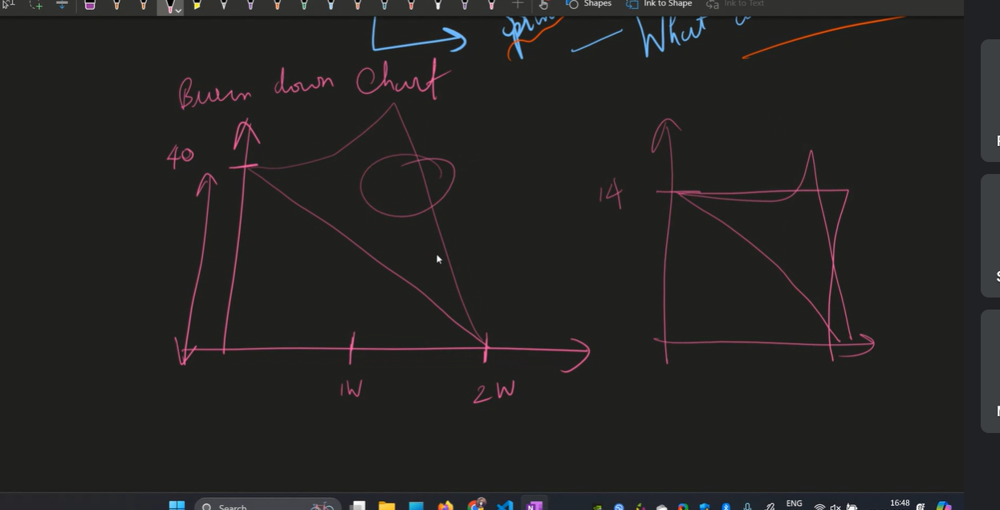
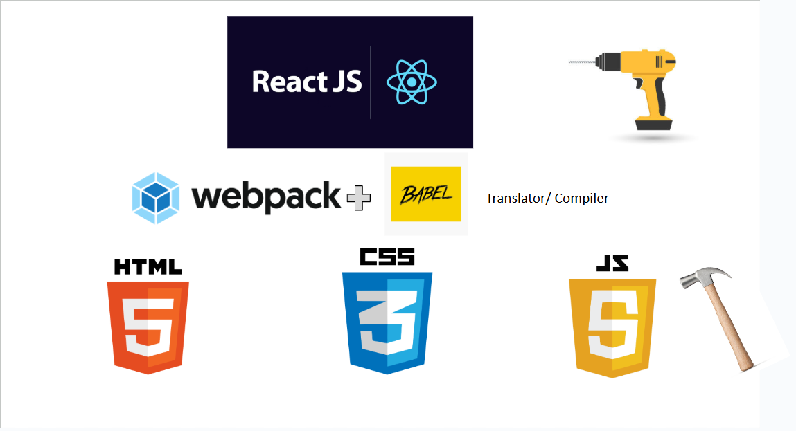
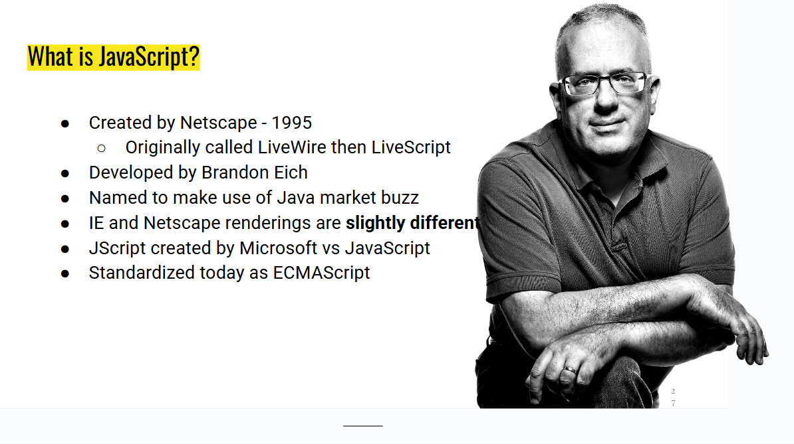
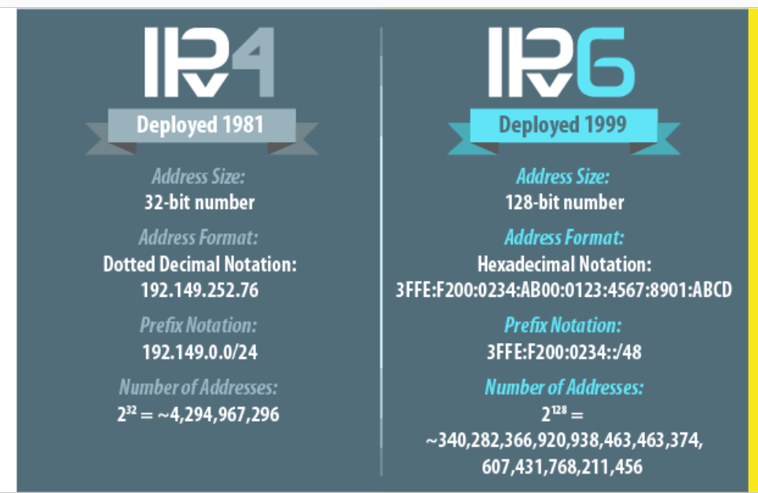
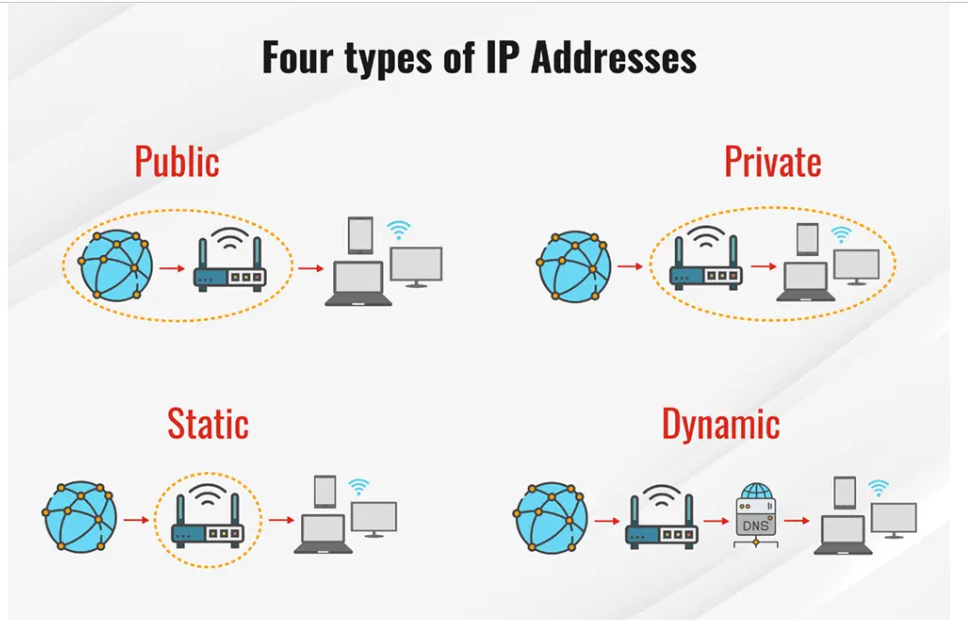
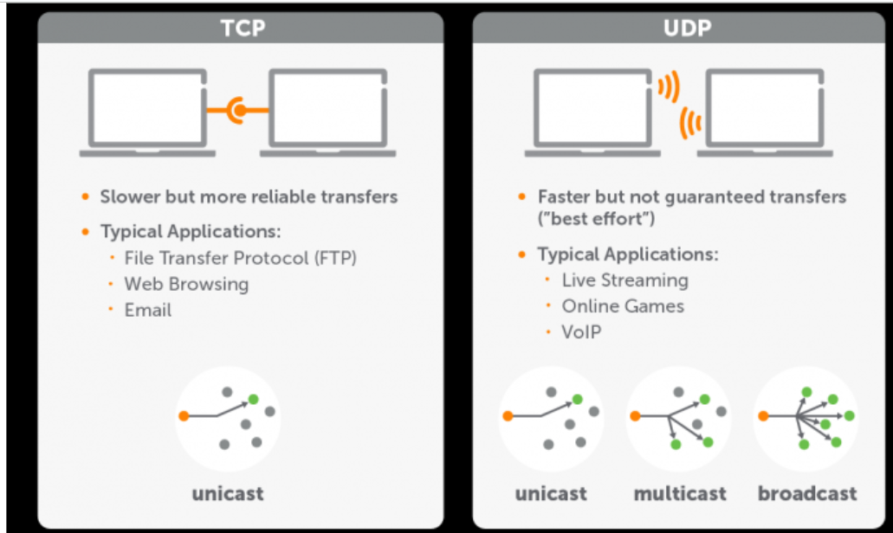
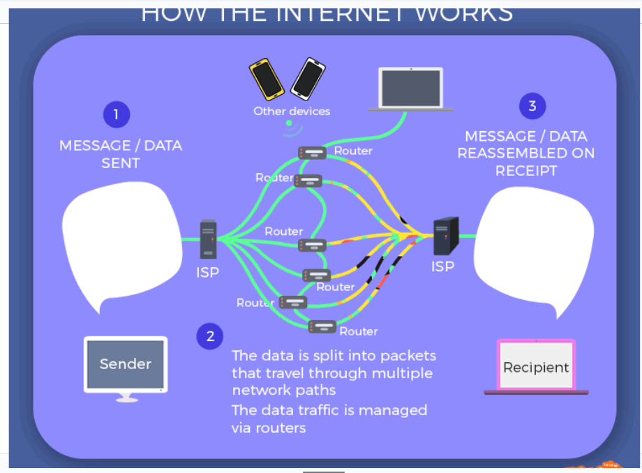
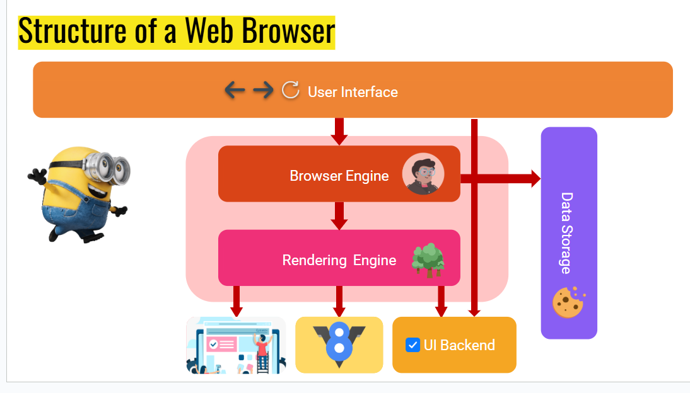
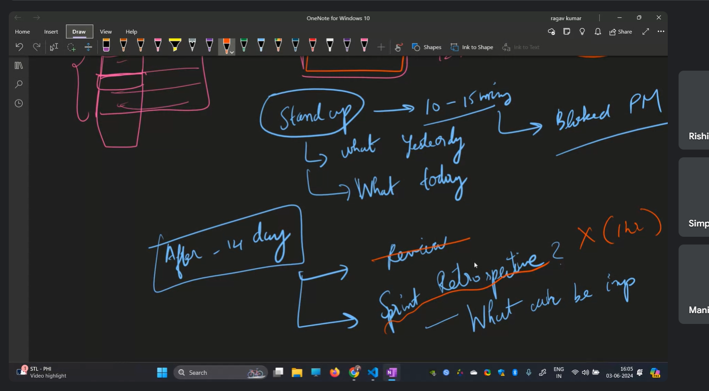
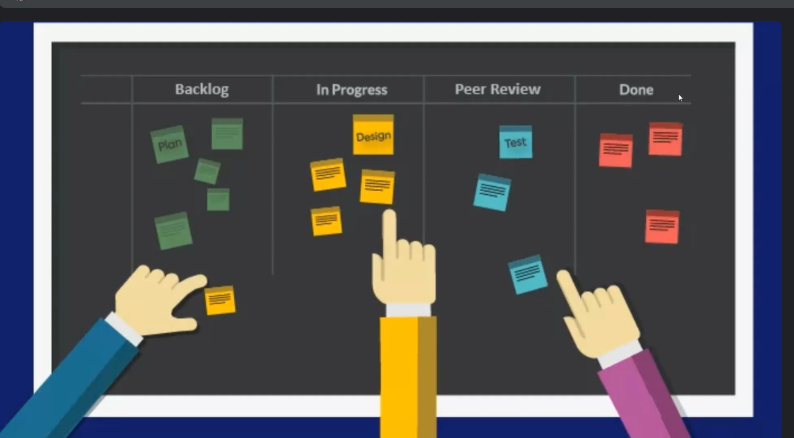

# intro to the web development
 - Browser can only undertans HTML, Css, and JS
 - The first web browser is WWW(worl wide web)
 - The first popular or first widely used is MOSAIC, which has back, forward, reload, minmize,maximize and close features.
 - NETSCAPE: Mosaic → developers left → formed Netscape → created Netscape Navigator (the successor to Mosaic).

## browser wars
- The first browsers war is b/w Netscape and Internet Explorer
- IE won the Browser War because it was pre-installed with Windows, and Windows dominated the PC market.
- Chrome was launched in 2008
- Chrome entered with powerful advantages:
- Much faster (new JavaScript engine "V8")
- Clean, minimalist UI
- Auto-updates
- Strong security sandboxing
- Backed by Google’s ecosystem
📉 What happened next:
- Chrome grew incredibly quickly.
- Firefox slowed down.
- Internet Explorer collapsed.
- By 2012, Chrome became the world’s most-used browser.
- Google hired people from Firefox
-  
This ended the dominance of both IE and Firefox.

Think of Chromium as:

The “engine + basic car frame” → browsers build their own custom car on top of it.

Chromium includes:

The browser engine (Blink)

The JavaScript engine (V8)

Security sandboxing

Tab system and UI basics

Extension support

Because it’s open-source, anyone can use it to create their own browser.

 # Web Archicture:
 - Front End(Client side)
 - Back End/Server
 - DataBase

# Transpiling & Bundling:
- 

React / Angular code
        ↓
      Babel   (transpiling)
        ↓
  Plain JavaScript
        ↓
     Webpack (bundling)
        ↓
HTML + CSS + JS
        ↓
      Browser
- Browsers only understand HTML, CSS, and JavaScript.
Framework code (React, Angular, JSX, TypeScript) is converted into plain JavaScript using tools like Babel, and then bundled using Webpack. This process is called transpiling (for Babel) and bundling (for Webpack).

# What is JS:

## 3 layer arch
- FE
- BE
- DB
# Coupling:
1️⃣ What is Coupling? (General idea)
Coupling = how much one part of code depends on another
High dependence → Tight coupling ❌
Low dependence → Loose coupling ✅

2️⃣ Tight Coupling ❌
Definition: Tight coupling means one class/module/function is strongly dependent on another specific class/module/function.
If you change one thing, many other things break.
# Micro Service Archicture: 
- Microservices architecture means:
- An application is split into small, independent services
- Each service:
Does one job
Has its own code
Often has its own database
Communicates with others via APIs

###  Why Loose Coupling Is REQUIRED for Microservices
❌ Tight coupling + Microservices = Problems
- If services are tightly coupled:
- Changing one service breaks others
- You must deploy everything together
- One failure can crash the whole system
- That defeats the purpose of microservices.

✅ Loose coupling + Microservices = Success
- Loose coupling allows:
- Independent deployment
- Independent scaling
- Technology freedom (Java, Node, PHP mixed)
- Fault isolation
------------------------------------------------------------
- One-line interview answer 🎯
Loose coupling is the foundation of microservices; microservices apply loose coupling at the system level so services can be developed, deployed, and scaled independently.

# What happens when you type "www.google.com"?
- 
URL typed
↓
DNS lookup
↓
IP address found
↓
HTTPS connection
↓
HTTP request sent
↓
Server processes
↓
HTTP response returned
↓
Browser renders page

- One-line interview answer 🎯
- When a URL is entered, the browser performs DNS lookup, establishes a secure connection, sends an HTTP request to the server, receives the response, and renders the webpage using HTML, CSS, and JavaScript.
```js
1️⃣ You type www.google.com in the browser

This is called a URL (Uniform Resource Locator).

The browser now needs to:

Find where Google’s server is

Ask it for the webpage

2️⃣ DNS Lookup (Name → IP address)

Computers don’t understand names like google.com.
They use IP addresses (example: 142.250.xxx.xxx).

What happens:

Browser checks its cache (have I visited before?)

If not found, it asks the OS

Then the router

Then a DNS server

DNS server replies with Google’s IP address

👉 This is like looking up a phone number in a contact list.

3️⃣ Browser creates an HTTP request

Now the browser knows where to send the request.

It creates a request like:

GET / HTTP/1.1
Host: www.google.com


This request says:

“Hey Google server, please send me your homepage.”

4️⃣ Secure connection (HTTPS / TLS)

Because Google uses HTTPS:

Browser and server perform a TLS handshake

Encryption keys are exchanged

A secure connection is established 🔒

This ensures:

Data privacy

No tampering

Server authenticity

5️⃣ Request travels over the Internet 🌍

The request:

Goes through routers

Passes ISPs

Reaches Google’s nearest data center

(This happens in milliseconds!)

6️⃣ Google’s server processes the request

On Google’s side:

A web server (like Nginx) receives the request

The backend decides what to return

It prepares:

HTML

CSS

JavaScript

Cookies, headers

7️⃣ Server sends back an HTTP response

The server replies with something like:

HTTP/1.1 200 OK
Content-Type: text/html


And sends the webpage content.

8️⃣ Browser renders the page 🖥️

Now the browser gets to work:

Rendering steps:

Parse HTML → build DOM

Load CSS → build CSSOM

Execute JavaScript

Fetch extra files (images, fonts, JS)

Paint pixels on the screen

👉 This is when you finally see Google’s homepage.

9️⃣ JavaScript continues working

After loading:

JS handles searches

Button clicks

Suggestions

Dynamic updates (AJAX)

The page stays interactive.

```

- #### Internet Protocol:
- def: IP (Internet Protocol) address = a unique number assigned to a device on a network so other devices can find and communicate with it.
- 
- ##### Types of IP Addresses:
- 
- Public: ISP will assign public IP to Router
- Private: router will asign private IP to devices like mobile, laptop etc.
- Static: A static IP is an IP address that never changes. It is manually assigned to a device.
- Dynamic: A dynamic IP is an IP address that changes automatically. Assigned by a DHCP server.
- #### TCP vs UDP
- 
- ##### How Internet Works:
- 
- ### Structure of Web Browser:
- 
```js
---

## 1️⃣ User Interface (UI)

* This is **what you see and interact with**:

  * Address bar
  * Back and forward buttons
  * Refresh button
  * Bookmark menu
* The **Minion icon** here just adds a fun touch!

---

## 2️⃣ Browser Engine

* This is the **control center** of the browser.
* It **connects the User Interface with the Rendering Engine and other components**.
* It decides **what happens when you click buttons** or enter URLs.
--------
What is a JavaScript Engine?
Simple definition:

JavaScript engine = the part of the browser that executes JavaScript code.

What it does:

Reads JavaScript

Compiles it into machine code

Executes it fast

Handles:

Variables

Functions

Events

DOM manipulation

Examples:

V8 → Chrome, Edge

SpiderMonkey → Firefox

JavaScriptCore → Safari


--------------------------------------------

## 3️⃣ Rendering Engine

* This part **renders (draws) the web page on your screen**.
* It takes the **HTML, CSS, JavaScript** from the web page and builds the visual page.
* It processes the content and turns it into the actual layout you see.
* The tree icon symbolizes the **DOM tree** the engine builds while parsing HTML.

---

What is a Rendering Engine?
Simple definition:
Rendering engine = the part of the browser that converts HTML, CSS, and JS results into what you see on the screen
What it does:

Reads HTML → builds the DOM

Reads CSS → builds the CSSOM

Combines them → Render Tree

Calculates layout (size & position)

Paints pixels on the screen

👉 This is why it’s called rendering (drawing).
Examples:

Blink → Chrome, Edge, Brave

Gecko → Firefox

WebKit → Safari
-------------------------

## 4️⃣ Data Storage

* This stores data locally on your device.
* Examples include:

  * Cookies (represented by the cookie emoji 🍪)
  * Cache
  * Local storage or IndexedDB
* It helps store preferences, login info, and speeds up page loading.

---

## 5️⃣ UI Backend

* This is responsible for **drawing basic widgets** like buttons, menus, and text boxes.
* It uses the platform's native APIs (Windows, Mac, Linux) to make the UI look consistent.

---

## 6️⃣ Summary Flow (How they work together)

* You interact with the **User Interface**.
* The **Browser Engine** handles your commands.
* It sends content to the **Rendering Engine** to build the page.
* The **Rendering Engine** renders the page.
* Both the **Browser Engine** and **Rendering Engine** may interact with **Data Storage**.
* The **UI Backend** draws basic components that you see and interact with.
```
-------------------------------------------------------------------------

# selector
```css

      .fun {
        color: rgb(231, 25, 25);
      }
      ``
```

[HTML status codes](https://developer.mozilla.org/en-US/docs/Web/HTTP/Status)

> to kepp hte text in the block

to keep an image in the note use-!:


> ./  
> .-> current directory
> /-> file name

"atl" attiribute--haev 3 uses

1.  when page is not loaded
2.  for the persons whoc cant see
3.  soe(search engine optimization) rating(in searching rating)

# webp--

it is an extension for image simislar to jpg etc
but this helps to reduce the size of the image wihtout change in the quality.

# svg(Scalable Vector Graphics)

Advantages of SVG files.

- Unlike raster files, which are made up of pixels, vector graphics like SVGs always maintain their resolution — no matter how large or small you make them. You don't have to worry about SVG images losing their quality in certain browsers or when you resize them to appear in different places.
- its smaller file sizes and ability to be scaled without losing quality.
- supported by all the browsers
- doesnot break when zoom in or zoom out.
- it uses mathemitical formulas rather than pixels.
- logos are generally svg.

```JS
var x=10
typeof(x)
/* dictionary*/
var student={
  name:"diana"
  age:20
}
typeof(student)# object
student.name # dot syntax
or student['name'] # box syntax

var marks=[1,2,4534,5]
typeof(marks) # object
20/0 # infinity

   var z;
   typeof(z) # undefined
   var c=null;
   typeof(c) # object

   var name="a"
   var name="b" ##allow
   let name="f"
   let name="o" ## not allowed
   const name="p"
   const name="k" ## not allowed
   var name="a"
   name="b" ## allowed
   let name="l"
   name="y" ## allowed
   const name="Q"
   name="h" ## not allowed


   const marks=[1,2,3,4];
   marks[0]=8; // posiible becoz not changing the address
   marks=[4,5,6,7]; // not allowed becoz the address will change
```

> # data types:
>
> string,number,boolean,objects,undefined

- tpye of an unassigned values is undefined.
- but the data type of a null value is object---->they know - that it is bug but they dont fix.

> redeclaration is not possible in let and const works only in var.
> reassignment is alloed in var and let, wont allow in const

- python tutor-for visual execution

# SCOPE:

> life time of variable

    - tell u the area where the variable  can be accessed.
    - {}----block
    - let & const are  -block scope
    - var is not block scope

```js
{
  var x1 = 10;
  let x2 = 20;
}
console.log(x1); // output=10
console.log(x2); //error
```

> undefined---value //when we declare a var but not assigned any value then there we will get undefined
> not defined-- error // we didinot even declared it so not defined
> var--- is function scope

# Conversions

```js
function fun() {
  var x1 = 10;
  let x2 = 20;
  console.log(x1); // output= 10
  console.log(x2); // 20
}
console.log(x1); // output= not defined (error)
console.log(x2); // not defined(error)

var x1 = 5;
var x2 = "5";
console.log(x1 + x2); //operative overloading (contact or addition)  concat is prior.
console.log(x1 - x2); // only one operation subtract (implicit typecasting or coersion)
console.log(x1 + parseInt(x2)); //output=10 (we are doing explicit type casting)
console.log(x1 + +x2); // 10

[2, 4, 5] + "abc"; // output--2,4,5abc
```

> explocit typecasting--

> js only knows concation--converting into string each element

```
[]+[]=' '
null+5==5 //null will be converined into 0, only for null, others will be conerted into string and concatination.

4+ "5a" //NAN--it is not able to convert 5a into number so the output is NAN-not a number.

typeof(NAN) // number

```

# === //faster - doesnot allow conversion

The strict equality operator (===) checks for the equality of two values without performing any type conversion. This means that if the values being compared have different data types, === will return false.  
 x1=5
x2="5"
x1===x2 // false

# == //slower -checks values--conversion + check

console.log(1 == "1"); // true and console.log(1 === "1"); // false.

In the first example, JavaScript will convert the string "1" to the number 1 before comparing it to the number 1. This results in the expression evaluating to true.
In the second example, JavaScript will not convert the string "1" to the number 1 because the strict equality operator (===) is being used. This results in the expression evaluating to false.

# Types of functions:

functions use-modular:add or remove the things you want easily. for doing any changes when we change the code that will be refelected in all without changing all the code.
parameters and arugments
fun(a){
} // a parameter
fun(8)// 8 is augment

## normal function

> exit the funtion 2 ways:

- when the rrturn statement is executed
- or else when all the statements are executed

```function defination or declaration:
function functionname(n){
  return 0;
}
```

## arrow function

```
const double =(n) => {
  return n*2
}
 or
 const double= (n) => n*2; //in one line (n*2 will be returned)

  ##  with 2 parameters:
  function sum(a,b){
    return a+b;
  }

  const sum1=(a,b)=> a+b;
```

## Annonmus

> NOTE: DRY

# code quality:

> there are 5 pillers to measure code quality.

1.  readibility--should be understood by others anf for u in future
2.  Maintianibility-code debt-tomorrow never come
3.  Extensibility-can be able to add new features
4.  Testability
5.  performance (space and time complixity)

### JS:

var t=null

> typeof(t)  
> 'object'

In web we dont fix problems/bugs
but we create new features.

## var declarations creating a variable

var---- can be changed.

let---- declarations cant be change

const------ cant be change

## var re-assigned

var----can happen

let---- can be done

const----cannot be done

```javascript
const marks = [35, 45, 75];
marks[1] = 78;
console.log(marks);
```

but in case of array if one index is changed then it gets changed because of the address in which it is stored differently.
so hence we can change values inside at the particular address.

> pythontutor.com

# DAY 2

null datatype is object

### SCOPE:

LIFETIME OF VARIABLE:  
GC IS PRESENT
UNTIL IT IS USED IT WILL STAY IN MEMORY.
AFTER THAT IT IS NO LONGER PRESENT.

```javascript
   {
            var x1=10;//block scope
            let x2=20;//block scope
        }
this is the block scope.
```

Var can be declared and accessed globally. Let can be declared globally, but its access is limited to the block in which it is declared.  
 Variables declared using var can be re-declared and updated within the same scope. Variables declared with let can be updated but not re-declared within the same scope.

undefined---value
not defined----error

```javascript
function fun() {
  var t1 = 10;
  let t2 = 20;
}
console.log(t1);
console.log(t2);
```

the output for both is no defined.

## TypeCasting

var x1=3;

var x2="5";

console.log(x1+x2);//it is concatinating instead ofadd up. becuase it is overloaded.(priority to concate more than add)

console.log(x1-x2)// converts string to 5 thats why its
this is inbuilt implicit conversion or coercion.

## explicit conversion

var x1=3;
var x2="5";

console.log(x1+parseInt(x2)); (doesnot allow decimal points )
console.log( x1+ +x2);  
 these are the two methods.

### conversions:

if [2,4,5] +"abc"
then it converts everything into string
so output is '2,4,5abc'

[]+[] (its is empty string+empty string)  
so output is empty string.
output is: ' '

ARRAY +STRING=STRING  
 ARRAY +ARRAY=STRING

null+5=

output=5

null is 0 in this case.

4\*"5a"
op:Nan

NaN/3
op:NaN

typeof(NaN)(it is trying to converting into number thats why the type of nan is number).
op:'number'

which is faster ?why?

var g1=5;
var g2="5";  
console.log(g1==g2)
console.log(g1===g2)
== allows typecasting(string is converted into number and verification is done)

=== doesnot allow type casting( only 1 step is done. )

=== is faster than ==

# TYPES OF FUNCTIONS

- Normal function
- Arrow function
- Anonymous Function

## NORMAL FUNCTION

```javascript
function double(n) {
  //n is the parameter
  return n * 2; // what if there is no return?
  // then undefined is printed instead of the particular op. so return is imp
} //returning to function call
console.log(double(10)); //10 is this argument
//this is function call

//to ways to exit
//1.if it encounters a return
//2. or last of the body
function double1(n) {
  if (n > 2) {
    return 5;
  }
  console.log("Hi");
  console.log("Hi");
  console.log("Hi");
  console.log("Hi");
}
double1(9);
double1(1);
```

## Arrow function

const double3=(n)=>{
return n*2;
};
//adv:if it is one line, it can done into this way (no need of return to mention)
const double4=(n)=>n*2;

function sum(a,b){
return a+b;

}
sum(9,8);

const sum2=(a,b)=>a+b;
sum2(6,7);

```

why functions?
DRY-TUMB RULE-DONT REPEAT YOURSELF.
ABSTRACT A LOGIC INTO FUNCTION
chnage in one place it reflects everywhere. (it affects everywhere)

modularity.
```

whom we are writing code?  
 for other teammates

# how do u measure code quality?

5 pillars

1. Readability-75%
2. Maintability(code debts----U'll make this code better 2mrw, but 2mrw never comes)(we shuld not have the code that is not maintainable)
3. Extensibility(it shuld be easy to add features)
4. Testability
5. performance(space &time complexity)
   readability>perfomance

## copy by value

var q1=[100,200];
var q3=[...q1];  
... ---> is the spread operator
then q3=[100,200]
if it is q1.push(100)
then q1 is [100,200,100]
q3 is [100,200]
beacuse it is value not address to get changed.

var q1=[100,200];
var q3=[q1];  
//it is nested array output

## Loops

```javascript
const marks = [80, 90, 100];
//more control
for (let index = 0; index < marks.length; index++) {
  console.log("index:", index, "marks", marks[index]);
}

//readbale and simple
for (let idx in marks) {
  //in-->index
  console.log("index:", idx, "marks:", marks[idx]);
}
//readable and cleaner
for (let mar of marks) {
  console.log("mark:", mar);
}
//here we dont have acces of index here so its better to use in than of
```

## DAY-4

ES6 FEATURES:

> LET&CONST
> TEMPLATE LITERAL (back tick)
> SPREAD OPERATOR
> REST OPERATOR
> DESTRUCTIONG
> CLASS' ARROW FUNCTION==>
> PROMISE
> NUMERIC SPEARATORS 1_00_00_00

## OBJECT METHODS

```javascript
let salaries = {
  john: 100,
  peter: 300,
  Mary: 300,
};

Object.keys(salaries);
Object.values(salaries);
```

# shortcuts

ctrl+shift+p==>to open all the commands(command palette)  
 ctrl+space==>auto complete

ctrl+clik=ck==.it is usfel for opening the things.

```javascript
//Template literal
//using backtick it makes code more readbale. just dollar and curly braces.
//it also supports multiline string with help of backtick .
const quotes = `Dream is not that u see in sleep, dream is something that does not let u sleep`;

const movieUrl = (domain, genre, year) =>
  `http://${domain}?genere=${genre}&year=${year}`;
//return "http://" + domain + "?genere=" + genre + "&year=" + year;

console.log(movieUrl("imdb.com", "thriller", 2020));
//refactoring u're not adding any feature,code will work in same way but quality better-->functionality same.
```

> color faded but not used in parameters....to change it we shuld use interpolation(i.e add $,backtick)

## ARRAY DESTRUCTURING

const[t1,t2]=[100,200];

//ARRAY DESTRUCTURING

const[t1,t2]=[100,200];

const[t1,t2,t3]=[100,50];  
//this gives an error undefined infor t3  
const[a1,a2,a3=80]=[100,200]  
/_when it is undefined it is taken as 80  
default value is taken only wen it is undefined  
const[]  
const[a1,a2,a3=80]=[100,200,500];  
here 500 is defined thats why a3 is taken as 500 instead of 80._/

var [t1, t2] = [100, 200];  
 console.log(t1, t2);  
 //output  
 100 200

var [t1,t2,t3]=[100,200];  
 console.log(t1,t2,t3)  
 //output  
 100 200 undefined

var [t1,t2,t3=80]=[100,200];  
 console.log(t1,t2,t3)  
 //here t3=80 is called as default value  
 //output  
 100 200 80

````

> The default value is only taken when t3 is undefined

```javascript

var [t1,t2,t3=80]=[100,200,500];
console.log(t1,t2,t3)
//output
100 200 500

var [t1,t2,t3=80]=[100,200,undefined];
console.log(t1,t2,t3)
//output
100 200 80

var [,t1,t2,t3=80]=[100,200,undefined];
[, is called as holes,]
-->why it is used?
to skip the value
console.log(t1,t2,t3) //output
200 undefined 80
````

> > This method is used to skip the values.This concept is called HOLES

```js
var [, , t1, t2, t3 = 80] = [100, 200, undefined];
console.log(t1, t2, t3); //undefined undefined 80
```

## Object destructuring

> The default value can be anything..number,object,etc..

- The object destructuring works on key-value based rather than the indexing.

```js
const {name,networth,power}={
  name:"Tony"
  house:🤠
  networth:🤑🤑🤑
  power:🦾

};
console.log(name);
console.log(networth);
console.log(power);
//output

Tony
🤑🤑🤑
🦾
```

> > The unpacking in array is done by indexing and the unpacking in Objects is done by Key considerations.

```js
const avengers={name:"Tony",   house:"🤠"
const avengers={
 name:"Tony",
 house:"🤠",
 networth:"🤑🤑🤑",
 power:"🦾",

};
console.log(name);
console.log(networth);
console.log(power);

const {name,networth,power}= avengers

this is by using object destructing
...................................
has context menu
The unpacking in array is done by indexing and the unpacking in Objects is done by Key considerations.

## The task1 code with refactoring by using object destruction


const cart = [
 { name: "apple", price: 0.5, quantity: 4 },
 { name: "banana", price: 0.25, quantity: 6 },
];

const newItems = [
 { name: "Cherry", price: 0.75, quantity: 5 },
 { name: "Date", price: 1, quantity: 3 },
];

//   Ex 1.1: Combine cart + newItems
const comb = [...cart, ...newItems];

var result = 0;
for (let { price, quantity } of comb) {
 result = r price * quantity;
}
console.log("The Total Price of all fruits : " + result);
//output
10.25;
```

## ES features

> > Unary operator : ++,--,!
> > binary operator : 2+5, 6-2, 9\*7 7/2

# Code snippets

# Truthy vs falsy

```js
let x = [];
if (x) {
  console.log("Hey");
} else {
  console.log("NOpe");
}
//output
Hey;
```

```js
let x = [null];
if (x) {
  console.log("Hey");
} else {
  console.log("NOpe");
}
//output
Hey;
```

```js
let x = null;
if (x) {
  console.log("Hey");
} else {
  console.log("NOpe");
}
//output
Nope;
```

## ES6

let and const
template literal
spread operator
rest operator
destructing
class
arrow function

## shortcuts

- ctrl + space -> autocomplete
- ctrl + / -> comment
- win + . -> emojis
- ctrl + , -> settings
- ctrl + shift + p -> command pallete

## Ternary condition

5>4 ?"awesome:"cool"

## Binary operators

arithematic +, - , / , \*
logical - && and operator || or operator
relational >,<,>=,<=,==,===

# unary operator

++ post increment
-- pre increment
! not

# Truthy vs falsy

```js
let x = "cool";
if (x) {
  console.log("hey");
} else {
  console.log("nope");
}
```

- if the value is converted true then its truthy(refer above ex)
- if the value is converted false then its falsy(refer below ex)

```js
let x = null;
if (x) {
  console.log("hey");
} else {
  console.log("nope");
}
o / p - nope;

let x = [];

if (x) {
  console.log("hey");
} else {
  console.log("nope");
}
o / p - hey;

var height = 150;
var final = 140 || height;
console.log(final);

var avgtemp = 20;
var temp = 0 || avgtemp;
console.log(temp);

//20(falsy values are followed here)
var avgtemp = 20;
var temp = 0 ?? avgtemp;
console.log(temp);
//0(for null and undefined  falsy table is followed)
//... is also used as rest operator-
```

## string methods

> split
> join
> tolowercase
> touppercase
> reverse
> slice
> push
> PASCAL CASE--->CarEngine
> Camel case--->

# the software development life cycle.(SDLC)

creating one design and other design--prototyping  
 figma->is the design tool
auto layout
coolors.co for colors used for designing.
for any app we develop

> planning  
> analysis  
> designing we do it figma....
> implementation----is developers  
>  testing and integration--pushing to the customers  
>  maintenance---every product will have support team to fix if anything is wrong.(very small small features are addded.)

## stakeholders.

they are the people who are responsible if anything goes wrong. they having the authority to change in the project.  
 People who are taking the risk.
responsible for make of the product.

## project manager:mainly on the business side. he will know accounting.

watch party:two people can watch the same show at a time ,it is paused it is paused for everyone.

## system architect

they will set up the project inititally.(to see which lang they shuld use.)what shuld be our FE,BE ABD db.  
It is the blue print of the project.  
ALL how they shuld be interact with each other.  
why we shuld shuld in our company.  
tailor making to the app
They shuld have knowledge about everything.
They shuld also know about the cloud.

## analysis:

P.O  
P.M  
business analyst  
Cto

## design

system architect  
ux/ui designer

## development

front-end
back-end

## testing

solutions architect  
qa engineer  
tester  
devops

## deployment

> data adminstrator  
> devops

## maintainance

> users  
> testers  
> support manager

.png>)

## structure of 6 phases

CEO+PM----->designer+PM --------->ceo+pm+designer --------->cto+pm-------->be+fe,cto,testing------>bet+fe(integration)tests-------->testing------>be+fe----->devops----->customers------>tickets raised(support team)----->again fe+be team will work on it.---->again testing,devops continuation until customer is satisfied.

designer+PM --------->ceo+pm+designer is business analysis  
cto+pm is technical analysis.  
be+fe,cto,testing------>bet+fe(integration) is implementation

### service and product based

> product based---->lots of investement in r&d (multiple customers) replicated easily .  
> lots of time  
> example:netflix (its not a one time thing.)  
> service based: its a one time thing,it is customised for a particular need only.  
> its for particular customer.  
> they keep on changing languages.

## methodologies:

## waterfall model

6 months time
reqiurement is clear
planning is done u cant shift columns after wrds,things cannot be changed  
eg:construction of bridge...is permanent we cant change it again if we want.  
for suppose: u want to change from react to angular,without changing any requirement only structure is changed (technology migration in IT)
customer interaction is not there,,,,what is last output is .
2 release

## agile

- everytime the cycle is keep on repeating regularly.
- monthly release is there to check waht is wrong.
- quickly make mistaken, learn from it and implememt again.
- deployements 3 times in day.
  2sprints in a month
  ( 1 sprint is 2 weeks)  
  ( 2 weeks for development  
  2 weeks for testing)

## implementing agile:

-scrum is the implementation of agile.

- why agile:interaction with the customer

## implementation of agile:

## SCRUM

!
tickets are for to see what people are dng what task.
sprint planning(1hr time)(task is split into small chunks)----->  
!

sprint planning---1hr
scrum master --assign the tasks.
<b>Story Points</b>-The time duration assigned to complete a particular task in the scrum

the task which is assigned---story point.(fibannoci)(estimated days to complete the task)(ask seniors)( 1 2 3 5 8)days
standup---(10-15min)  
block-there are stuck in between without doing the task.  
sprint retrospective----what can be improved can be said.(1 hr)

.

## HOW TO RUN THE

- ONES CODE IS CHECKED BY ANOTHER VICE VERSA----PEER REVIEW (code quality is checked)(if they are following any coding standards)
- WORK WHICH IS NOT DONE---BACKLOG(T0-DO)
- WHICH IS RUNNING RIGHTNOW---(IN PROGRESS)

<b>kanban board</b>: its a tool for managing the scrum.

# BURNDOWN CHART:

Describes the task flow at which time

- It is regarding the progress.
- this shows the continuous work

!

<b>spill-over</b>:sharing the work left in one sprint to another sprint.

!

## coding standards:

Are meant have uniformity throughout ur code base

## code Quality

## Dry

## variables name

- understandable/descriptive

```js
let a = 50; //❌
let age = 50; //✅
```

- camelCase

```js
let student_name="aishwarya";❌
let studentName="aishwarya";✅
```

- choose 'let' over 'var','const' over 'let'

```js
let panCard="B153729EHDIH";❌
const panCard="B153729EHDIH";✅

```

```js
const PI_VALUE="3.14";✅
const pi_Value="3.14";❌
```

### errors(for variable name)

- reserved keywords('if','for')

```js
let if="aishwarya";❌
```

- cannot start with numbers

```js
let 2cool="aishwarya";❌
```

- cannot have specail symbols($,2,#,!)EXCEPT FOR '\_'

```js
let abc$123="aishu";❌
let abc_123="aishu";✅✅
```

## Documentation

- Single comment

```js
//
```

- Multiline comments

```js
/*
 *this is cool
 *function
 */
```

# JS DOCS

```JS
/**
*JSDOC advantage:auto-complete.
 * Multiplies two numbers.
 * @param {number} x - The first number.
 * @param {number} y - The second number.
 * @returns {number} The product of x and y.
 * @example
 * multiply(2, 3); // returns 6
 */
function multiply(x, y) {
  return x * y;
}
```

```js
/**
 * Making to uppercase.
 * @param {string} str - The first string
 *
 * @returns {string} The uppercase of the particular string
 * @example
 * tomakeUppercse("aishu"); // returns AISHU
 */
function tomakeUppercse(str) {
  return str.toUpperCase();
}
```

# html:

emmet cheatsheet

# anker tag:

target attribute =\_blank then the link will open in other page(tag) instead of same page.

we can give phone numbers(in anker tag give <b> ahref="tel:9000906504"</b>) and emails(href="mailto:paishwarya.com")

# types of css:

- internal
- inline
- external

# why internal css:

time of rendering will be reduced.
it is used for initial page.  
 concise is the key.

# why external css:

the same link can be used for different html pages(files).

# css terms


has context menu
